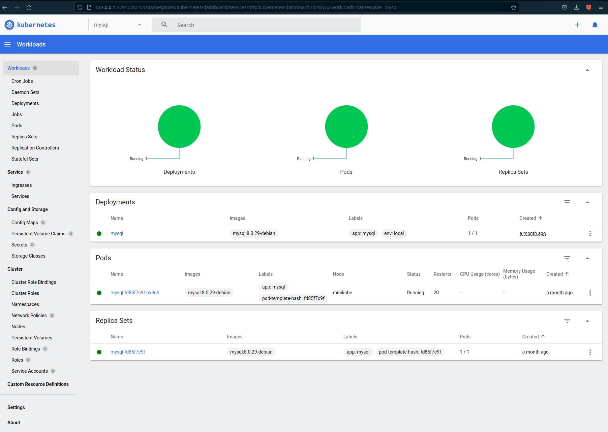
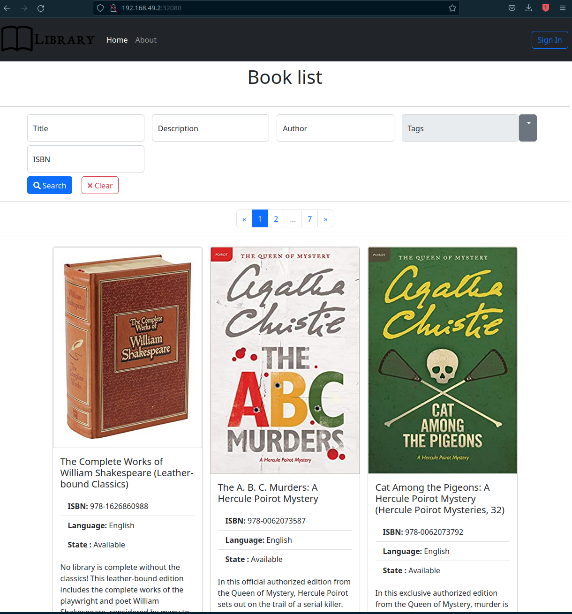

= PHP Projects

== Overview

Projects in this repository use link:https://kubernetes.io/[kubernetes] for development.
link:https://www.mysql.com/[MySQL] and link:https://www.php.net/manual/en/install.fpm.php[PHP-FPM] (with Nginx) deployments are described using link:https://kustomize.io/[Kustomize]

=== Project structure

Worth noting files and directories are listed above:

[source,text]
----
├── apps
│   └── p1
│       ├── database
│           ├── liquibase
│           ├── migration
├── infra
│   └── k8s
│       ├── my-sql
│       └── php-fpm
├── Makefile
----

==== apps

This directory contains PHP source code which is later deployed (copied) to the php-fpm pod.

==== apps/p1

This is the main directory of the project containing source code as well as data migration.

==== apps/p1/database

This directory contains the data migration script and liquibase tool used for data migration.

==== apps/p1/database/liquibase

Contains liquibase CLI tool used for data migration.

==== apps/p1/database/migration

Contains migration scripts, mysql JDBC connector as well as `liquibase.properties` file, which contains database URL and credentials.

==== infra

This directory contains infrastructure description for MySQL and PHP-FPM (with Nginx) deployments.

Kubernetes infrastructure code is written using Kustomize overlay engine.

==== infra/k8s/my-sql/kustomize

Base and overlay kustomize definitions are stored here for MySQL Kubernetes deployment.

* link:infra/k8s/my-sql/kustomize/base[base] directory contains base configs which aren't deployable themselves.
* link:infra/k8s/my-sql/kustomize/overlays/local/[overlay/local] directory contains local directory which overwrites some base configs and is fully deployable.

==== infra/k8s/php-fpm/kustomize

Base and overlay kustomize definitions are stored here for PHP-FPM Kubernetes deployment.

* link:infra/k8s/php-fpm/kustomize/base[base] directory contains base configs which aren't deployable themselves.
* link:infra/k8s/php-fpm/kustomize/overlays/local/[overlay/local] directory contains local directory which overwrites some base configs and is fully deployable.

==== infra/k8s/php-fpm/build

Contains link:infra/k8s/php-fpm/build/Dockerfile[Dockerfile] for building base PHP-FPM docker image.

==== infra/k8s/php-fpm/deploy-app.sh

This is a script which deploys the app to the running Kubernetes PHP-FPM deployment.

==== Makefile

This file contains targets which help to create local infrastructure and deploying application to local Kubernetes cluster.

== Running the application

=== 1. Install minikube with docker - link:https://docs.docker.com/get-docker/[Get Docker]

*Windows* and *MacOS* Docker for Desktop comes with a built-in minikube.

=== 2. _[Optional] Some Linux distributions: Install minikube - link:https://minikube.sigs.k8s.io/docs/start/[Minikube start]_

In case Docker for your OS doesn't come with the minikube installed, install it separately.

=== 3. Start minikube cluster

Start minikube using docker vm driver:

[source,shell]
----
minikube start --vm-driver=docker
----

Verify minikube cluster is running

[source,shell]
----
minikube status

minikube
type: Control Plane
host: Running
kubelet: Running
apiserver: Running
kubeconfig: Configured
docker-env: in-use
----

[source,shell]
----
kubectl get namespaces

NAME                   STATUS   AGE
default                Active   84d
kube-node-lease        Active   84d
kube-public            Active   84d
kube-system            Active   84d
----

==== 3.1. Minikube dashboard addon

Enable the addon

[source,shell]
----
minikube addons enable dashboard # to access minikube cluster Dashboard Web Application
----

Access the dashboard.
It will redirect you to your default browser to the dashboard page and open as an active process in your terminal.

The dashboard will be available as long as the process remains active.
You may abort the process pressing CTRL+C, which will send the SIGINT (interrupt) signal to the process and close it.

[source,shell]
----
minikube dashboard
----

The dashboard looks more less like this (you can select the namespace in the top-left corner select menu).

=== 4. Build or load downloaded PHP-FPM docker image for the minikube docker registry

==== 4.1. Loading downloaded image

You can download php-fpm docker image using this link - link:https://wutwaw-my.sharepoint.com/:u:/g/personal/01005591_pw_edu_pl/EcySDwMJnOFAvv75VcGsoHcBTEUT7sFufJyz_tvpx-CHSQ?e=Echlja[php-fpm-latest-tar.gz].

Or you can build the docker image yourself.

===== 4.1.1. Set minikube docker-env

Linux or MacOS:

[source,shell]
----
eval $(minikube docker-env)
----

Windows:

[source,text]
----
& minikube -p minikube docker-env --shell powershell | Invoke-Expression
----

===== 4.1.2. Load docker image to Kubernetes registry

====== 4.1.2.1. Load docker image

[source,shell]
----
make php-fpm-load PHP_FPM_IMAGE_PATH=/path/to/php-fpm-latest-tar.gz
----

====== 4.1.2.2. Build docker image

[source,shell]
----
make php-fpm-build
----

====== 4.1.2.3. Verify image exists in Kubernetes registry

Verify image exists in Kubernetes docker registry:

[source,shell]
----
docker images
REPOSITORY            TAG             IMAGE ID       CREATED         SIZE
php-fpm               latest          67351a5f375b   4 weeks ago     521MB
----

=== 5. Prepare MySQL Database

==== 5.1. Create MySQL kubernetes deployment using provided scripts

===== 5.1.1. Create MySQL kubernetes deployment

[source,shell]
----
make mysql-install-local
----

Verify the Kubernetes MySQL database is ready:

[source,shell]
----
kubectl -n mysql get deployment,pod,service,pv,pvc,secret

NAME                    READY   UP-TO-DATE   AVAILABLE   AGE
deployment.apps/mysql   1/1     1            1           32d

NAME                        READY   STATUS    RESTARTS       AGE
pod/mysql-fd85f7c9f-bx9qh   1/1     Running   19 (15h ago)   32d

NAME                    TYPE           CLUSTER-IP     EXTERNAL-IP   PORT(S)          AGE
service/mysql-service   LoadBalancer   10.110.10.40   <pending>     3306:32306/TCP   32d

NAME                                                        CAPACITY   ACCESS MODES   RECLAIM POLICY   STATUS   CLAIM                               STORAGECLASS   REASON   AGE
persistentvolume/mysql-pv-volume                            2Gi        RWO            Retain           Bound    mysql/mysql-pv-claim                manual                  32d

NAME                                   STATUS   VOLUME            CAPACITY   ACCESS MODES   STORAGECLASS   AGE
persistentvolumeclaim/mysql-pv-claim   Bound    mysql-pv-volume   2Gi        RWO            manual         32d

NAME                         TYPE                                  DATA   AGE
default-token-6c2kz   kubernetes.io/service-account-token   3      32d
secret/my-sql-secret         Opaque                                1      32d
----

Root user password is stored in link:infra/k8s/my-sql/kustomize/overlays/local/my-sql-secret.yml[my-sql-secret.yml] file.

===== 5.1.2. Connect to the kubernetes database

Obtain database address using minikube's command:

[source,shell]
----
minikube -n mysql service mysql-service --url

http://192.168.49.2:32306
----

And connect to the database (based on the data above):

[source,text]
----
host: 192.168.49.2
port: 32306
user: root
password: <from my-sql-secret.yml file>
----

==== 5.2. Provide your own MySQL database

You can always provide your own MySQL database.

==== 5.3. Create user and BOOK_LIB database for PHP application

[source,sql]
----
CREATE DATABASE BOOK_LIB;

CREATE USER 'booklib'@'%' IDENTIFIED WITH mysql_native_password BY 'b0o#lib';

GRANT ALL PRIVILEGES ON BOOK_LIB.* TO 'booklib'@'%';
----

=== 5.4. Load initial MySQL data

Load initial MySQL data executing SQL commands from MySQL dump file
link:https://wutwaw-my.sharepoint.com/:u:/g/personal/01005591_pw_edu_pl/EdeGhHLRTmRIr8HkXZ0h1l4B1b4IFfhMGpoflDalfcnwTQ?e=8ubzD4[book_lib_dump.sql].

=== 6. _[optional] Provide mysql credentials for PHP application_

In case you created a DB user with a different password, specify it in the
link:infra/k8s/php-fpm/kustomize/overlays/local/php-fpm-db-secret.yml[php-fpm-db-secret.yml] file.

=== 7. Create PHP-FPM kubernetes deployment

Create PHP-FPM kubernetes deployment executing the following command:

[source,shell]
----
make php-fpm-install-local
----

Verify PHP-FPM deployment is running:

[source,shell]
----
kubectl -n php-fpm get deployment,pod,service,pv,pvc,cm,secret

NAME                          READY   UP-TO-DATE   AVAILABLE   AGE
deployment.apps/php-fpm-web   1/1     1            1           16d

NAME                              READY   STATUS    RESTARTS      AGE
pod/php-fpm-web-5554df869-plss7   2/2     Running   2 (15h ago)   20h

NAME                      TYPE           CLUSTER-IP       EXTERNAL-IP   PORT(S)        AGE
service/php-fpm-service   LoadBalancer   10.107.230.222   <pending>     80:32080/TCP   16d

NAME                                                        CAPACITY   ACCESS MODES   RECLAIM POLICY   STATUS   CLAIM                               STORAGECLASS   REASON   AGE
persistentvolume/php-fpm-pv-volume                          2Gi        RWO            Retain           Bound    php-fpm/php-fpm-pv-claim            standard                16d

NAME                                     STATUS   VOLUME              CAPACITY   ACCESS MODES   STORAGECLASS   AGE
persistentvolumeclaim/php-fpm-pv-claim   Bound    php-fpm-pv-volume   2Gi        RWO            standard       16d

NAME                             DATA   AGE
configmap/kube-root-ca.crt       1      16d
configmap/php-fpm-db-config      2      13d
configmap/php-fpm-nginx-config   1      16d

NAME                         TYPE                                  DATA   AGE
secret/default-token-w76bh   kubernetes.io/service-account-token   3      16d
secret/php-fpm-db-secret     Opaque                                2      13d
----

=== 7. Deploy the application

Manually deploy a project running the following make target:

[source,shell]
----
make app-deploy
----

link:https://github.com/ksync/ksync[Ksync] use is considered in the future, to enable project directory monitoring and live synchronisation with the web server.

== Access the application

The application is available at the address:

[source,shell]
----
minikube -n php-fpm service php-fpm-service --url

http://192.168.49.2:32080
----

Enter the link:http://192.168.49.2:32080[alt="http://192.168.49.2:32080"] in your browser to access the application.

=== Users

MySQL dump comes with a few already registered users.

.Users
|===
|Login |Password |Roles

|abc@abc.com
|zaq1@WSX
|USER

|abcd@abc.com
|zaq1@WSX
|USER

|employee@library.com
|employee
|USER,EMPLOYEE
|===

pass:[*] USER role isn't inserted to the DB, because every single registered user has this role and storing it would be redundant.

